## Hi there 👋

<!--
**AltesHaus/AltesHaus** is a ✨ _special_ ✨ repository because its `README.md` (this file) appears on your GitHub profile.

Here are some ideas to get you started:

- 🔭 I’m currently working on ...
- 🌱 I’m currently learning ...
- 👯 I’m looking to collaborate on ...
- 🤔 I’m looking for help with ...
- 💬 Ask me about ...
- 📫 How to reach me: ...
- 😄 Pronouns: ...
- ⚡ Fun fact: ...
-->

<!-- Maintenance: scripts/create-orbital-hud.mjs reads activity counts from authenticated
GitHub search. assets/activity-stats.json preserves the last authenticated snapshot.
Set the GH_PAT Actions secret with access to the relevant repositories to refresh
these counts automatically; without it, scheduled builds retain the dated snapshot.
The contribution-calendar total uses GitHub's separate profile contribution rules.
Reviewed PRs counts PRs created within the displayed range that this user reviewed,
not individual review submissions. -->
